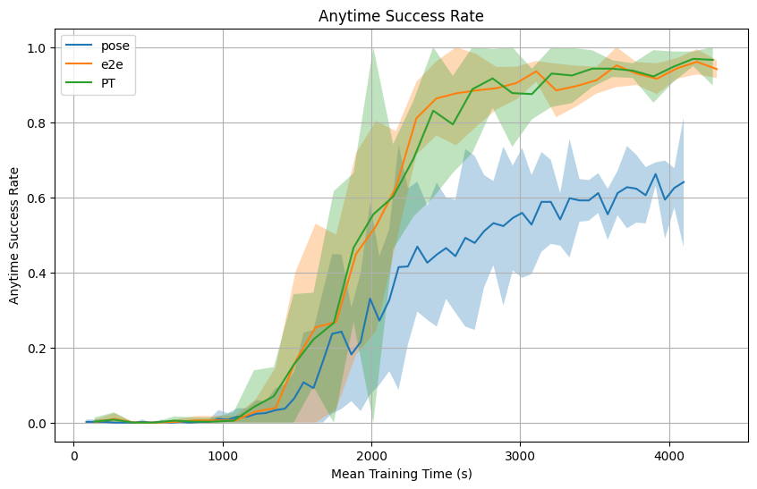
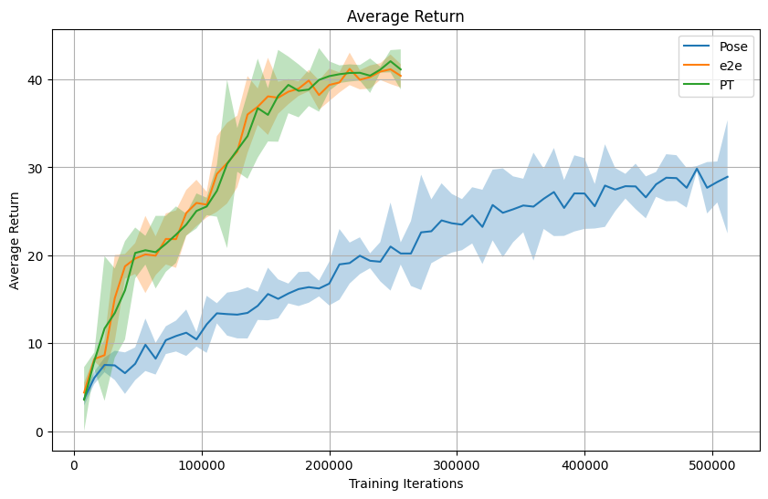
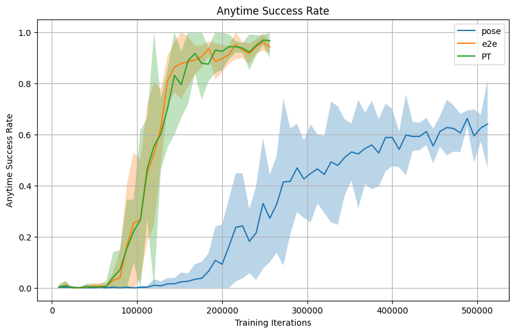
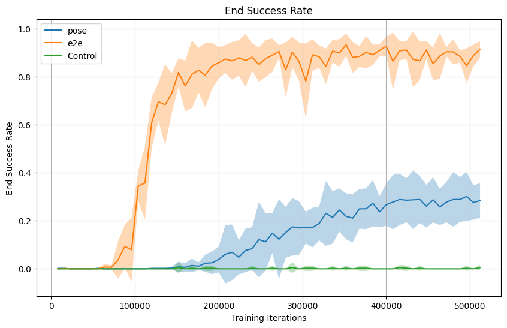

# End-to-end RGB SAC vs. Position-Estimator + State SAC

This project compares two ways of solving ManiSkill’s `PickCube-v1` task with Soft Actor-Critic (SAC):

1. End-to-end learning from RGB observations.
2. A hybrid approach that predicts the cube position from RGB once at the start of the episode and feeds that estimate into a state-based SAC policy.

The main question was simple: is it better to let the policy learn directly from pixels, or to compress vision into a small, task-relevant state estimate first?

## Key findings

- **End-to-end RGB SAC clearly outperformed the estimator-based pipeline**, finishing at roughly 0.9 success versus 0.4.
- **Estimator-conditioned SAC had an early speed advantage**, but it did not maintain that lead as training progressed.
- **A learned cube position alone was not enough**, indicating that the policy benefited from richer scene information than a compact state estimate could provide.

## Why this is interesting

Simulation gives access to privileged state information that is not normally available in the real world. I wanted to test whether a learned visual position estimator could bridge that gap well enough to support strong control, while keeping the policy input compact and efficient.

This turned into a comparison between:
- learning control directly from images, and
- learning a visual abstraction first, then controlling from that abstraction plus state.

## Setup

All experiments used ManiSkill `PickCube-v1`. Two comparisons were conducted: a practical comparison leveraging the architectural advantages of the position estimator approach, and a controlled comparison keeping models and observations as similar as possible using the same base configuration.

### Approach 1: End-to-end RGB SAC
The policy received RGB observations directly and learned control end-to-end.

### Approach 2: Position-estimator + state SAC
A pretrained CNN estimated the cube position from RGB at the start of each episode. That predicted position was concatenated with the policy state input and reused for the rest of the episode.

I trained the estimator only on the cube’s initial position. In this task, the cube stays fixed until the robot contacts it, so this setup matched the intended deployment assumption and kept the estimator focused on information available before interaction.

## Controlled Comparison

With model size and resolution held constant between approaches, the position estimation approach performed poorly, ultimately failing to learn a successful policy. In order for an estimator-based approach to be viable, its inherent architectural advantages needed to be leveraged. Specifically, using a larger model, applying Batch Normalization, and increasing the input resolution allowed for a much more precise position estimate. These changes brought the RMSE down from about 0.04 to 0.01, reducing the cube position error from roughly 4cm down to 1cm.

## Practical Comparison (Model Differences)

The two approaches in the final practical comparison did not use identical model sizes or image resolutions. Furthermore, the estimator used supervised pretraining with BatchNorm, while the end-to-end RL encoder did not. Therefore, this comparison is highly informative regarding real-world deployment tradeoffs, but is not a perfectly controlled architecture match.

| Approach | Observation Resolution | Vision Model Size | Policy MLP Hidden Size | Total Parameters |
|---|---|---|---|---|
| **End-to-end SAC** | 96x96 | Smaller CNN | 256 | ~366,000 |
| **Position-estimator + state SAC** | 128x128 | Larger CNN | 384 | ~609,000 (294k estimator + 315k policy) |

These differences were driven by the computational advantages of the position estimation approach. Because the estimator only ran once per episode, it could be trained with a larger model and higher resolution without slowing down policy training. Conversely, the end-to-end method required a smaller model and lower resolution to keep training time reasonable and memory use manageable.

## Results

Despite the architectural advantages given to the position estimator, the end-to-end method was clearly better by final performance.

- End-to-end RGB SAC reached about 0.9 success.
- Position-estimator + state SAC reached about 0.4 success.
- The estimator-based method had a short-lived wall-clock advantage early in training, but did not keep up.

The figures below show success rate over wall-clock time, followed by return, anytime success rate, and final success rate over training steps.

| Return vs. training steps | Anytime success vs. training steps | End success vs. training steps |
|:---:|:---:|:---:|
|  |  |  |

## Takeaways

The learned position estimate captured an important part of the task, but not enough of it. End-to-end vision gave the policy access to richer scene information and real-time visual feedback, which mattered a lot once the robot started interacting with the cube.

The biggest lesson from this project is that compressing vision into a single predicted object position can be too restrictive, even when that position seems like the most important feature.

## Repo notes

- `e2e/`: end-to-end RGB SAC experiments
- `pose/`: position estimator and estimator-conditioned SAC experiments
- `multi_main.py`: runs multiple seeded instances
- `config.yaml`: shared experiment settings
