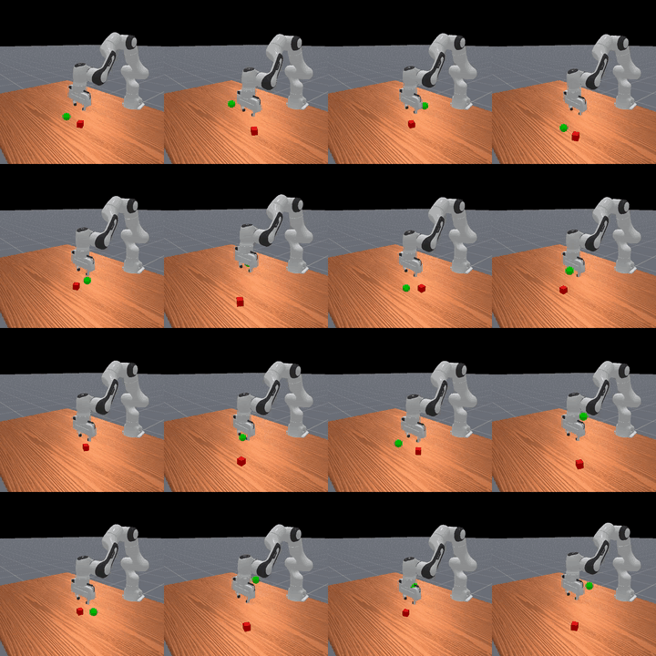
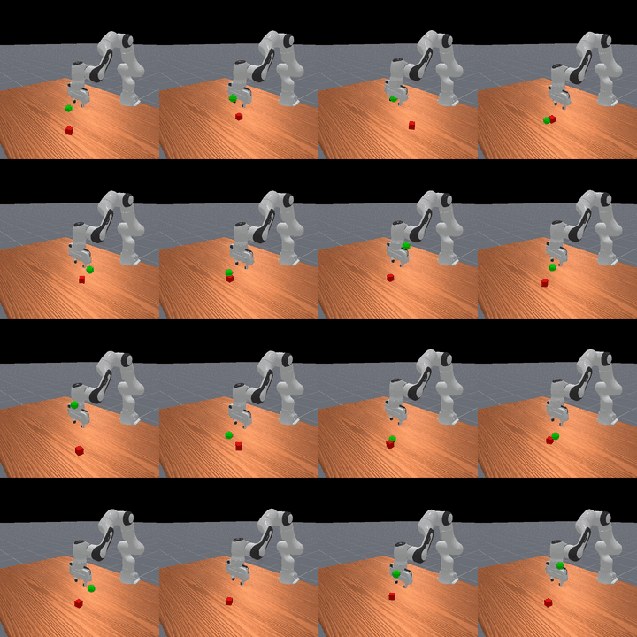

# RGB SAC vs. Estimator SAC

This project compares two approaches for solving ManiSkill’s `PickCube-v1` task using Soft Actor-Critic (SAC):

1. End-to-end learning directly from RGB observations.
2. A hybrid approach that predicts the cube position from RGB at the start of the episode and feeds that estimate into a state-based SAC policy.

| End-to-End RGB SAC (16/16 Success) | Position-Estimator + State SAC (9/16 Success) |
|:---:|:---:|
|  |  |

The core question is simple: is it better to let a policy learn directly from pixels, or to first compress that visual data into a small, task-relevant state estimate?

## Key Findings

- **End-to-end RGB SAC clearly outperformed the estimator pipeline**, finishing with a ~0.9 success rate versus ~0.6.
- **Estimator-conditioned SAC had an early speed advantage**, but it lost its lead as training progressed.
- **A learned cube position alone was insufficient**, indicating the policy relies heavily on richer scene information that a compact state estimate lacks.
- **Pose estimation pretraining did not improve end-to-end performance** or sample efficiency, suggesting the policy easily learns useful visual features on its own during end-to-end training.

## Why This Matters

Simulation gives access to privileged state information rarely available in the real world. I wanted to test whether a learned visual position estimator could bridge that gap well enough to support strong control, all while keeping the policy input compact and efficient. 

This created a direct comparison between learning control directly from images and learning a visual abstraction first to drive control.

## Setup

All experiments used ManiSkill `PickCube-v1`. The goal is to pick up a cube, bring it to a target position, and hold it steady.

### Approach 1: End-to-end SAC
The policy received RGB observations directly and learned control end-to-end. I also tested pretraining the encoder using position estimation to see if it boosted initial sample efficiency.

### Approach 2: Position-estimator SAC
A pretrained CNN estimated the cube position from RGB at the start of each episode. The model concatenated that predicted position with the policy state input and reused it for the rest of the episode. 

I trained the estimator only on the cube’s initial position. Since the cube stays fixed until the robot touches it, this setup matched the intended deployment assumption and kept the estimator focused entirely on pre-interaction data.

## Model Differences

The two approaches used slightly different architectures. The estimator required supervised pretraining with BatchNorm, which was crucial for performance and lowered the MSE loss by roughly 30x (final MSE of ~0.00007 vs ~0.002). In contrast, the end-to-end RL encoder skipped BatchNorm entirely.

| Approach | Total Parameters |
|---|---|
| **End-to-end SAC** | ~373,000 |
| **Position-estimator + state SAC** | ~341,000 (197k estimator + 144k policy) |

The policy MLP input size drove the major difference in parameter counts. The estimator outputs a 3D position, while the end-to-end policy receives a 128D encoding. Both architectures concatenate their respective vision outputs with a 29D state vector.

## Pose Estimation as a Tuning Heuristic

One unexpected benefit of the position-estimator pipeline was its utility for rapid architecture search and hyperparameter tuning. Training a CNN for supervised pose estimation takes only seconds, whereas training the full RL policy takes hours. 

Crucially, the CNN architecture that achieved the lowest MSE on the pose estimation task was also the most effective vision encoder for the end-to-end RL pipeline (with the notable exception of removing BatchNorm). This makes supervised pose estimation an excellent, low-cost proxy for tuning the vision backbone before committing to expensive RL runs.

## Results

Despite the position estimator's early speed advantage, the end-to-end method ultimately achieved better final performance, sample efficiency, and wall-clock time. 

- End-to-end RGB SAC reached ~0.9 success.
- Position-estimator + state SAC reached ~0.6 success.
- Pretraining the encoder resulted in a negligible difference for end-to-end performance.

The figures below show the average success rate across seeds over wall-clock time, followed by return, anytime success rate, and final success rate over training steps. 

**(e2e - End-to-end, PT - Pretrained encoder, pose - Position estimator)**

| Return vs. training steps | Anytime success vs. training steps | End success vs. training steps |
|:---:|:---:|:---:|
|  |  |  |

## Takeaways

The learned position estimate captured an important part of the task, but not enough of it. End-to-end vision gave the policy access to richer scene information and real-time visual feedback, which became critical once the robot started interacting with the cube.

The biggest lesson from this project is that compressing vision into a single predicted object position can be too restrictive, even when that position seems like the most important feature.

## Repo Notes

- `e2e/`: End-to-end RGB SAC experiments.
- `pose/`: Position estimator and estimator-conditioned SAC experiments.
- `multi_main.py`: Runs multiple seeded instances.
- `config.yaml`: Shared experiment settings.

## Acknowledgments

This project builds on the foundations of several excellent tools and algorithms:
- **Soft Actor-Critic (SAC):** The core reinforcement learning algorithm driving the policies.
- **BRO:** For the baseline architecture and reinforcement learning implementations.
- **ManiSkill:** The robotic manipulation benchmark providing the `PickCube-v1` environment and high-performance simulation framework.
